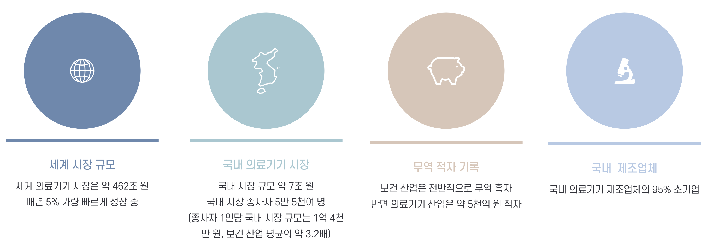
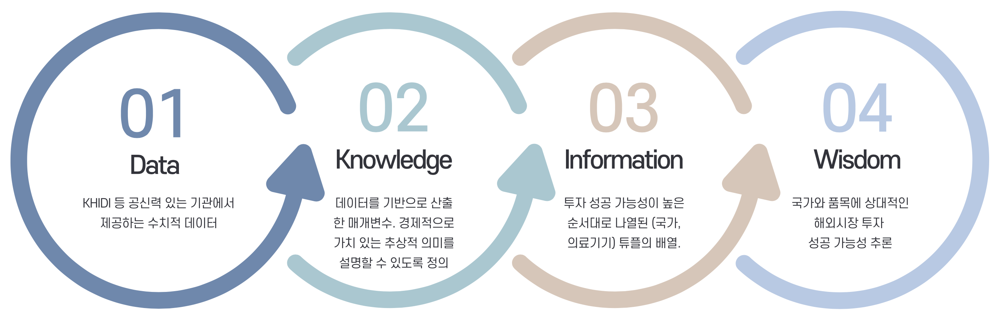
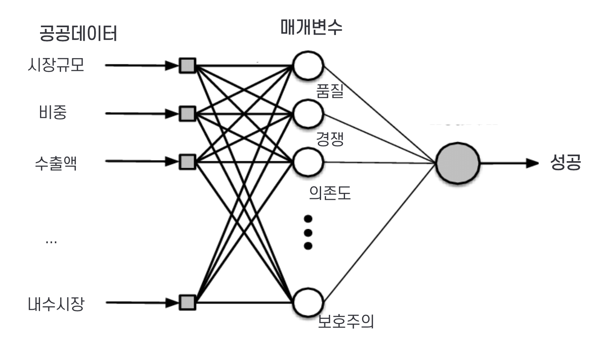
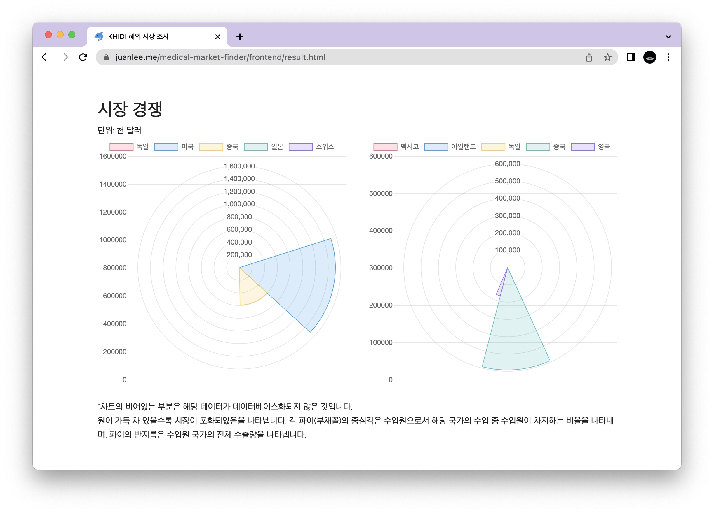

# 의료기기의 품목 간 비교분석을 통한 해외시장 진출 타당성 진단 프로그램
본 프로젝트는 2022년 [KHIDI](https://www.khidi.or.kr/kps) 공공데이터 활용 아이디어 공모전에서 우수상을 수상하였습니다 🎉

## 필요성 및 배경
의료기기 산업의 해외시장을 개척하기 위해서는 조사 단계부터 공공데이터를 활용한 해외 진출 컨설팅 서비스가 필요합니다. 그러나 현재 의료기기의 품목 및 해외시장 관련 정보는 PDF 형식의 브리프로 제공되어 데이터를 비교·대조·계량분석하기 어렵습니다.

## 모델
의료기기의 해외시장 진출을 컨설팅하는 전문화된 서비스를 다음과 같이 제안합니다.

### 블록체인 기반 데이터베이스

위와 같이 DKIW 형식을 따르는 데이터베이스를 우선적으로 구성합니다.
* **Data** 단계는 공신력 있는 기관이 제공하는 Open Data가 저장됩니다.
* **Knowledge** 단계는 Data를 통해 연산된 매개변수가 저장됩니다.
* **Information** 단계는 Knowledge를 통해 최종적으로 추론된 성공가능성이 저장됩니다.
* **Wisdom** 단계는 Information을 사용자에게 보고서 형식으로 제공하여 사용자로 하여금 해외시장 진출에 대한 지혜를 얻게 합니다.

이 데이터베이스는 또한 블록체인 기반으로 구성되어 오픈 데이터의 보안성과 익명성을 유지하는 한편, 확장성과 안정성까지 얻을 수 있습니다.

### 각 매개변수의 정의
**Knowledge**와 **Information** 단계에서 사용되는 매개변수의 정의는 다음과 같습니다.

* **Quality**, 품질: A국의 B제품 수출량
* **Competition**, 경쟁력: A국가로 수출하는 국가들의 품질 가중치 평균
* **Dependency**, 무역의존도: 수입량 / 시장 규모
* **Protectionism**, 보호주의: 내수시장 점유율 / 품질
* **Success**, 성공 가능성: 수출 대상국 무역 의존도 및 우리나라의 품질에 비례하고, 대상국의 품질, 보호주의, 경쟁력에 반비례합니다.

### XAI 기반 예측 모델
정형화된 딥러닝 모델은 추상적 의미를 가지지 않는 은닉 계층을 통해 모델을 구성하여, 사용자에게 모델의 의미를 전달하거나 바뀌는 전문적인 상황에 맞춘 즉각적 피드백이 어렵습니다.

반면 본 예측 모델은 최근의 XAI(eXplainable AI)의 추세에 발맞추어, 다소 비정형화되었지만 의미를 설명 가능한 은닉 계층을 사용함으로서, 해외 사업과 같은 파급력이 큰 의사 결정에 있어 사용자에게 충분한 신뢰를 담보합니다.

## 데모
> https://sleepy-juan.github.io/medical-market-finder/frontend/

본 프로그램은 실행 데모를 제공하고 있습니다. 데모에서는 KHIDI에서 제공하는 실제 데이터를 기반으로 다음과 같은 정보를 제공합니다.
* 두 국가의 의료기기 수출 성공 가능성 비교 리포트
* 시장 점수 상세
* 수출액 정보 한눈에 보기
* 경쟁력 정보 한눈에 보기

## 파급효과
본 프로그램은 단순한 예측 모델로 끝나지 않고 새로운 고부가가치를 창출하는 서비스가 되기를 바랍니다. 따라서 다음과 같은 파급효과를 가집니다.
* 데이터베이스 제공을 통한 의료기기 데이터의 계량분석 가능성
* XAI 진단 보고서 제공을 통한 사용자의 시장 신뢰도 확보
* API 제공을 통한 사용자 맞춤형 확장 프로그램
* 기존 해외 사업 컨설팅을 온전히 대체하는 자동화된 분석 체계